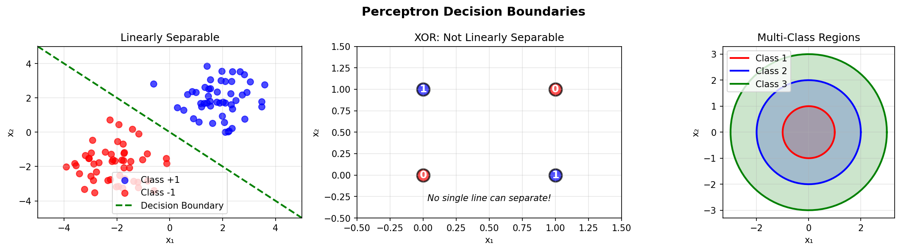
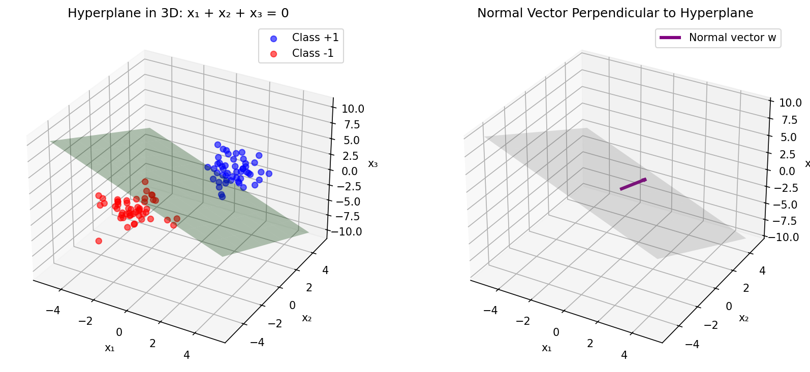
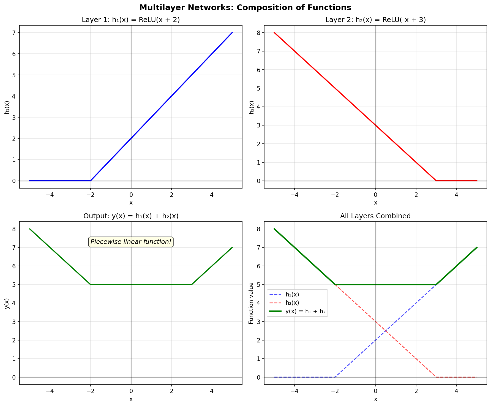
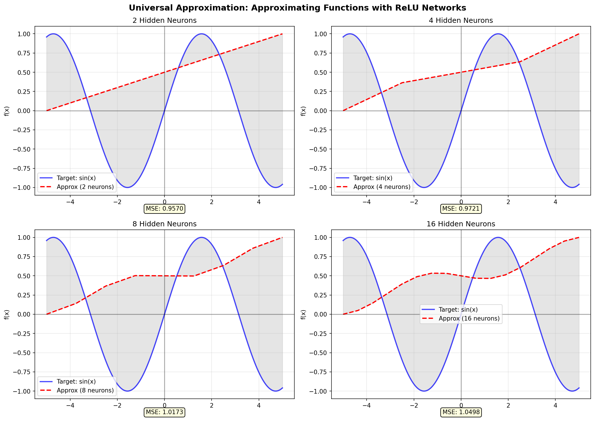

# Session 01 Part A: Neural Networks - Geometric Intuition and Approach

## Table of Contents

1. [The Learning Problem: Pattern Recognition in High Dimensions](#the-learning-problem-pattern-recognition-in-high-dimensions)
2. [Biological Inspiration and Mathematical Abstraction](#biological-inspiration-and-mathematical-abstraction)
3. [The Perceptron: A Linear Classifier](#the-perceptron-a-linear-classifier)
4. [Geometric View: Hyperplanes in Feature Space](#geometric-view-hyperplanes-in-feature-space)
5. [Limitations of Linear Models](#limitations-of-linear-models)
6. [Multilayer Networks: Composition of Functions](#multilayer-networks-composition-of-functions)
7. [Feature Learning vs Feature Engineering](#feature-learning-vs-feature-engineering)
8. [Universal Approximation: Expressive Power](#universal-approximation-expressive-power)
9. [The Brain Tumor Classification Task: A Motivating Example](#the-brain-tumor-classification-task-a-motivating-example)

---

## The Learning Problem: Pattern Recognition in High Dimensions

Machine learning, at its core, addresses the fundamental problem of learning a mapping from inputs to outputs based on observed examples. Consider the task our neuropathology classifier faces: given an MRI image containing millions of pixel values, determine which of 17 distinct pathological conditions (or normal tissue) the image represents.

The input space for our problem is extraordinarily high-dimensional. An MRI scan resized to 224×224 pixels with 3 color channels yields an input vector in $\mathbb{R}^{150528}$ (since $224 \times 224 \times 3 = 150{,}528$). Each image is a single point in this vast 150,528-dimensional space. Our task is to partition this space into 17 regions, one for each class, such that when a new, unseen image arrives, we can reliably determine which region it belongs to.

This partitioning problem is what neural networks excel at solving. Rather than attempting to hand-craft rules or explicitly define the boundaries between classes—an intractable task in such high dimensions—neural networks learn these boundaries directly from data through a process of iterative optimization.

The learning paradigm is supervised: we provide the network with many labeled examples $\{(\mathbf{x}_1, y_1), (\mathbf{x}_2, y_2), \ldots, (\mathbf{x}_N, y_N)\}$ where each $\mathbf{x}_i$ is an input image and $y_i$ is its corresponding label (one of the 17 pathology classes). The network's objective is to find a function $f: \mathbb{R}^{150528} \to \{1, 2, \ldots, 17\}$ that minimizes prediction errors on these training examples while generalizing well to new, unseen images.

The challenge lies not merely in fitting the training data—any sufficiently complex model can memorize the training set—but in learning the underlying structure that allows generalization. Neural networks achieve this through carefully designed architectures, regularization techniques, and optimization procedures that we will explore throughout this tutorial.

## Biological Inspiration and Mathematical Abstraction

The term "neural network" originates from early attempts to model the computational properties of biological neurons. In the 1940s, Warren McCulloch and Walter Pitts proposed a simplified mathematical model of neural computation, followed by Frank Rosenblatt's perceptron in the 1950s. While modern neural networks have diverged significantly from biological realism, the core computational motif remains: simple processing units (artificial neurons) combine their inputs through weighted sums and nonlinear activation functions, and these units are organized into layers that transform representations from raw inputs to abstract concepts.

A biological neuron receives electrochemical signals through dendrites, integrates these signals in the cell body (soma), and if the integrated signal exceeds a threshold, generates an action potential that propagates along the axon to other neurons. The strength of connections between neurons (synapses) varies, giving different inputs different weights in the integration process.

The artificial neuron abstracts this process mathematically. Given an input vector $\mathbf{x} = [x_1, x_2, \ldots, x_n]^T \in \mathbb{R}^n$, an artificial neuron computes:

$$z = \sum_{i=1}^{n} w_i x_i + b = \mathbf{w}^T \mathbf{x} + b$$

where $\mathbf{w} = [w_1, w_2, \ldots, w_n]^T$ is a weight vector and $b$ is a bias term. This weighted sum $z$ is then passed through a nonlinear activation function $\sigma$:

$$a = \sigma(z) = \sigma(\mathbf{w}^T \mathbf{x} + b)$$

The output $a$ is the neuron's activation, analogous to the firing rate of a biological neuron.

While the biological metaphor provides useful intuition, it's important to recognize that modern deep learning has moved beyond faithful biological modeling. The mathematics of optimization, linear algebra, and calculus provide the true foundation for understanding neural networks. The "neural" terminology persists more for historical reasons than biological fidelity.

## The Perceptron: A Linear Classifier

The perceptron, introduced by Frank Rosenblatt in 1958, is the simplest neural network: a single artificial neuron that performs binary classification. Understanding the perceptron provides crucial geometric intuition for more complex networks.

Consider a binary classification problem where we must separate input points into two classes. The perceptron computes:

$$\hat{y} = \text{sign}(\mathbf{w}^T \mathbf{x} + b)$$

where $\text{sign}(z) = +1$ if $z > 0$ and $-1$ if $z \leq 0$. The perceptron predicts class $+1$ when $\mathbf{w}^T \mathbf{x} + b > 0$ and class $-1$ otherwise.

The decision boundary is the set of points where $\mathbf{w}^T \mathbf{x} + b = 0$. In two dimensions ($\mathbf{x} \in \mathbb{R}^2$), this is a line; in three dimensions, a plane; in general, a hyperplane in $\mathbb{R}^n$.

Consider a simple two-dimensional example. Suppose $\mathbf{w} = [1, 2]^T$ and $b = -3$. The decision boundary is:

$$w_1 x_1 + w_2 x_2 + b = 0 \implies x_1 + 2x_2 - 3 = 0 \implies x_2 = \frac{3 - x_1}{2}$$

This is a line in the $x_1$-$x_2$ plane. Points above this line (where $x_1 + 2x_2 - 3 > 0$) are classified as $+1$, and points below (where $x_1 + 2x_2 - 3 < 0$) are classified as $-1$.

The weight vector $\mathbf{w}$ is perpendicular (normal) to the decision boundary. To see this, consider two points $\mathbf{x}_a$ and $\mathbf{x}_b$ on the boundary, so $\mathbf{w}^T \mathbf{x}_a + b = 0$ and $\mathbf{w}^T \mathbf{x}_b + b = 0$. Subtracting these equations:

$$\mathbf{w}^T (\mathbf{x}_a - \mathbf{x}_b) = 0$$

This means $\mathbf{w}$ is orthogonal to any vector connecting two points on the boundary, hence orthogonal to the boundary itself. The magnitude $\|\mathbf{w}\|$ doesn't affect the direction of the normal but does affect the "margin" or distance of points from the boundary.

The bias term $b$ controls the offset of the hyperplane from the origin. If $b = 0$, the hyperplane passes through the origin. Increasing $b$ shifts the hyperplane in the direction of $-\mathbf{w}$.

The distance of a point $\mathbf{x}$ from the decision boundary is given by:

$$d = \frac{|\mathbf{w}^T \mathbf{x} + b|}{\|\mathbf{w}\|}$$

This formula comes from the point-to-hyperplane distance formula in linear algebra. The numerator $|\mathbf{w}^T \mathbf{x} + b|$ measures how far $\mathbf{x}$ is from satisfying the boundary equation, and normalizing by $\|\mathbf{w}\|$ converts this to an actual Euclidean distance.

## Geometric View: Hyperplanes in Feature Space

Neural networks fundamentally perform classification by partitioning the input space using hyperplanes (or more generally, nonlinear decision surfaces). Each neuron in a network can be viewed as defining a half-space: the region where the neuron's pre-activation $z = \mathbf{w}^T \mathbf{x} + b$ is positive versus negative.

In a single-layer network (like the perceptron), we have exactly one hyperplane dividing the space. Points on one side of the hyperplane are classified as one class, points on the other side as the other class. This is a linear classifier because the decision boundary is a linear function of the inputs.

For problems that are linearly separable—meaning a single hyperplane can perfectly separate the two classes—the perceptron learning algorithm is guaranteed to find a solution. However, many real-world problems are not linearly separable. The classic example is the XOR (exclusive or) problem: given two binary inputs, output 1 if exactly one input is 1, otherwise output 0. No single line can separate the four XOR patterns $\{(0,0) \to 0, (0,1) \to 1, (1,0) \to 1, (1,1) \to 0\}$.

The inability of single-layer perceptrons to solve XOR led to the famous critique by Marvin Minsky and Seymour Papert in their 1969 book *Perceptrons*, which contributed to the first "AI winter." The solution, which we'll explore next, is to use multiple layers.

## Limitations of Linear Models

Linear classifiers, while geometrically intuitive and computationally efficient, have fundamental limitations. They can only partition the input space into two regions separated by a single hyperplane. Many real-world classification problems require much more complex decision boundaries.

Consider our brain tumor classification task. The 17 different pathology classes likely occupy complex, intertwined regions in the 150,528-dimensional input space. An MRI of a glioma might share many low-level features (edges, textures) with an MRI of a meningioma; the distinguishing characteristics might be subtle patterns that require nonlinear combinations of features.

A single linear classifier cannot capture these complex patterns. Even using multiple independent linear classifiers (one per class in a one-vs-rest scheme) doesn't solve the problem, as each classifier is still limited to a single hyperplane.

The fundamental issue is that linear models compute a linear function of the input features. If the features themselves don't have a simple linear relationship with the class labels, the model will fail. This is where feature engineering traditionally came in: domain experts would manually design nonlinear features (e.g., ratios of pixel intensities, texture statistics, shape descriptors) that have better linear separability. But this process is labor-intensive, requires domain expertise, and doesn't scale to complex problems.

## Multilayer Networks: Composition of Functions

The solution to the limitations of linear models is to stack multiple layers of neurons, creating a multilayer perceptron (MLP) or, more generally, a feedforward neural network. The key insight is that composing multiple simple functions can produce arbitrarily complex functions.

Consider a two-layer network. The first layer computes:

$$\mathbf{h} = \sigma(\mathbf{W}_1 \mathbf{x} + \mathbf{b}_1)$$

where $\mathbf{W}_1$ is a weight matrix, $\mathbf{b}_1$ is a bias vector, and $\sigma$ is applied element-wise. This produces a hidden representation $\mathbf{h}$. The second layer then computes:

$$\hat{y} = \sigma(\mathbf{W}_2 \mathbf{h} + \mathbf{b}_2)$$

Combining these, we have:

$$\hat{y} = \sigma(\mathbf{W}_2 \sigma(\mathbf{W}_1 \mathbf{x} + \mathbf{b}_1) + \mathbf{b}_2)$$

This is a composition of affine transformations and nonlinear activations. The first layer can be viewed as learning a new representation (feature space) $\mathbf{h}$ from the raw input $\mathbf{x}$. The second layer then performs classification in this learned feature space.

Geometrically, each neuron in the first layer defines a hyperplane in the input space. The activation function (typically a nonlinearity like ReLU or sigmoid) determines which side of the hyperplane is "active." The collection of all first-layer neurons partitions the input space into regions defined by the intersection of half-spaces. The second layer then performs a linear combination of these regions to make the final decision.

This is why nonlinearity is crucial. If we used linear activations $\sigma(z) = z$, the entire network would collapse to a single linear transformation:

$$\hat{y} = \mathbf{W}_2 (\mathbf{W}_1 \mathbf{x} + \mathbf{b}_1) + \mathbf{b}_2 = (\mathbf{W}_2 \mathbf{W}_1) \mathbf{x} + (\mathbf{W}_2 \mathbf{b}_1 + \mathbf{b}_2)$$

which is equivalent to a single-layer network with weights $\mathbf{W} = \mathbf{W}_2 \mathbf{W}_1$ and bias $\mathbf{b} = \mathbf{W}_2 \mathbf{b}_1 + \mathbf{b}_2$. Nonlinearity breaks this compositionality collapse, allowing each layer to contribute genuinely new computational capacity.

## Feature Learning vs Feature Engineering

Traditional machine learning pipelines separated feature extraction from classification. A human expert would design a feature extraction algorithm (e.g., SIFT for images, Fourier transforms for audio) to convert raw data into a feature vector, then train a classifier (e.g., SVM, logistic regression) on these features.

Neural networks, in contrast, perform end-to-end learning: they learn both the features and the classifier simultaneously. The early layers of a neural network act as feature extractors, learning hierarchical representations of increasing abstraction. The later layers use these learned features for classification.

This is particularly powerful for images. In a convolutional neural network (which we'll cover in detail in Session 02), early layers learn to detect edges, curves, and simple textures—analogous to the receptive fields of neurons in the primary visual cortex (V1) of the mammalian brain. Middle layers combine these low-level features to detect more complex patterns like parts of objects (eyes, wheels, windows). Late layers detect whole objects or semantic concepts.

Crucially, these features are learned from data, not hand-designed. The network automatically discovers which features are relevant for the task. For our brain tumor classification, the network might learn to detect specific texture patterns characteristic of gliomas, or intensity gradients characteristic of contrast enhancement in meningiomas, or structural features like midline shift or mass effect—all without explicit programming.

This is why deep learning has been so successful in domains like computer vision and natural language processing where good features are difficult to engineer manually. The network learns a hierarchy of features tailored to the specific task and dataset.

## Universal Approximation: Expressive Power

A natural question arises: how expressive are neural networks? Can they represent any function we might want to learn?

The universal approximation theorem, proven in various forms by Cybenko (1989), Hornik (1991), and others, provides a reassuring answer. It states that a feedforward network with a single hidden layer containing a finite number of neurons can approximate any continuous function $f: \mathbb{R}^n \to \mathbb{R}^m$ on a compact subset of $\mathbb{R}^n$, given appropriate activation functions (like sigmoid, tanh, or ReLU).

More precisely, for any continuous function $f$ on a compact domain $K \subset \mathbb{R}^n$, any $\epsilon > 0$, and any activation function $\sigma$ that is continuous and not a polynomial, there exists a single-hidden-layer network:

$$F(\mathbf{x}) = \sum_{j=1}^{M} v_j \sigma(\mathbf{w}_j^T \mathbf{x} + b_j)$$

such that $|F(\mathbf{x}) - f(\mathbf{x})| < \epsilon$ for all $\mathbf{x} \in K$.

This theorem tells us that neural networks are universal function approximators: in principle, they can represent any function. However, the theorem has important caveats:

First, it's an existence result, not a constructive one. It guarantees that a suitable network exists but doesn't tell us how to find it. Training neural networks via gradient descent doesn't come with guarantees of finding the optimal solution.

Second, the theorem doesn't bound the number of neurons required. For some functions, the required number $M$ might be astronomically large, making the network impractical.

Third, the theorem applies to networks with unbounded width (the number of neurons in the hidden layer) but only a single hidden layer. Modern deep learning has shown that depth (many layers, each with moderate width) is often more efficient than width (a single very wide layer). Deep networks can represent certain function classes exponentially more efficiently than shallow ones.

The intuition for why depth helps is hierarchical composition. A deep network can build up complex functions by composing simpler functions layer by layer. For instance, to detect a face, a deep network might first detect edges (layer 1), combine edges into facial parts like eyes and noses (layer 2), and finally combine these parts into a face detector (layer 3). A shallow network would need to learn the entire face detector from raw pixels in one step, requiring far more neurons.

Despite these caveats, the universal approximation theorem gives us confidence that neural networks have the representational capacity for complex tasks. The challenge is not whether a suitable network exists, but whether we can find it through training.

## The Brain Tumor Classification Task: A Motivating Example

Let's ground these abstract concepts in our concrete problem: classifying brain MRI scans into 17 pathology categories. This task exemplifies why neural networks, and particularly deep convolutional networks, are the appropriate tool.

The input is a 224×224×3 RGB image derived from an MRI scan. Note that MRI scans are typically grayscale, but our preprocessing converts them to three-channel RGB for compatibility with pretrained networks (like MobileNetV2) that expect RGB inputs. Each pixel value is normalized to the range [0, 1].

The output is a probability distribution over 17 classes:
1. Glioma T1
2. Glioma T1C+ (contrast-enhanced)
3. Glioma T2
4. Meningioma T1
5. Meningioma T1C+
6. Meningioma T2
7. Normal T1
8. Normal T2
9. Neurocitoma T1
10. Neurocitoma T1C+
11. Neurocitoma T2
12. Outros (other lesions) T1
13. Outros T1C+
14. Outros T2
15. Schwannoma T1
16. Schwannoma T1C+
17. Schwannoma T2

Each class represents a distinct neuropathology type and MRI sequence combination. The classifier must learn to distinguish these based on subtle differences in image appearance.

Why is this task challenging? Several reasons:

**High dimensionality**: The input space is 150,528-dimensional. Finding decision boundaries in such high dimensions is intractable without strong inductive biases.

**Subtle differences**: Many tumors have overlapping imaging characteristics. Distinguishing a low-grade glioma from a meningioma requires recognizing subtle patterns in tissue texture, enhancement patterns, and anatomical location.

**Within-class variability**: Not all gliomas look identical. There's substantial variation in size, shape, intensity, and location. The classifier must generalize across this variation.

**Limited data**: Medical imaging datasets are relatively small compared to natural image datasets (which can have millions of examples). Our model must generalize from perhaps a few thousand examples.

**Domain shift**: MRI images differ substantially from natural images in the ImageNet dataset. They're grayscale (converted to RGB), have different statistics, and depict anatomical structures rather than everyday objects.

These challenges motivate our architectural choices, which we'll detail in later sessions:

**Transfer learning**: We start with a pretrained network (MobileNetV2 trained on ImageNet) to leverage general visual features learned from millions of images.

**Convolutional architecture**: Convolutional layers exploit the spatial structure of images, using far fewer parameters than fully connected layers while being translation-invariant.

**Two-stage training**: We first train only the classification head (freezing the base network) to avoid catastrophically forgetting pretrained features, then fine-tune the entire network.

**Data augmentation**: We artificially expand the training set through rotations, flips, and zooms to improve generalization.

**Regularization**: Dropout and batch normalization prevent overfitting to the small training set.

In the geometric picture we've developed, our neural network learns to partition the 150,528-dimensional input space into 17 regions. The early layers (inherited from MobileNetV2) detect low-level features like edges and textures. Middle layers detect higher-level patterns like tissue boundaries and anatomical structures. The final classification head (which we train from scratch) combines these features to make the 17-way classification decision.

The network learns a mapping from raw pixel intensities to a probability distribution over pathologies. During training, we show the network thousands of labeled examples, and it adjusts its parameters (millions of weights) to minimize prediction errors. Despite the enormous parameter space, careful initialization (using pretrained weights), regularization, and optimization enable the network to generalize to unseen examples.

This is the power and beauty of deep learning: by composing simple operations (linear transformations and nonlinearities) in a deep hierarchy, we can learn extraordinarily complex functions directly from data, without hand-crafting features or decision rules.

In the next part, we'll formalize these intuitions with precise mathematical definitions, setting the stage for understanding the mechanics of training and inference in neural networks.

## Visualizing Decision Boundaries and Hyperplanes

Understanding neural networks geometrically requires visualizing how they partition input space. Let's examine this across different scenarios.

### Two-Dimensional Decision Boundaries

In the simplest case, a single neuron (perceptron) divides the 2D plane with a line. Consider three scenarios:

**Linearly Separable Data**: When data from two classes can be perfectly separated by a straight line, a single perceptron suffices. The decision boundary $\mathbf{w}^T\mathbf{x} + b = 0$ is the line perpendicular to the weight vector $\mathbf{w}$.

**Non-Linearly Separable (XOR)**: The classic XOR problem demonstrates the limitations of linear classifiers. The four points $(0,0), (0,1), (1,0), (1,1)$ with labels $0, 1, 1, 0$ respectively cannot be separated by any single line. This fundamental limitation motivated the development of multilayer networks.

**Multi-Class Classification**: For more than two classes, we need multiple decision boundaries. Each boundary separates one class from the others, creating regions in the input space.

*Figure: Left - Linearly separable data with decision boundary. Center - XOR problem showing impossibility of linear separation. Right - Multi-class regions formed by multiple boundaries.*

### Hyperplanes in Higher Dimensions

When we move beyond two dimensions, decision boundaries become **hyperplanes**—$(d-1)$-dimensional subspaces in $d$-dimensional space.

For three dimensions, the decision boundary is a plane. For our brain MRI classification problem with 150,528 dimensions, the decision boundary is a 150,527-dimensional hyperplane—impossible to visualize directly, but mathematically well-defined.

*Figure: Left - Points on both sides of a hyperplane in 3D space. Right - Normal vector perpendicular to the hyperplane, determining its orientation.*

The **normal vector** $\mathbf{w}$ is perpendicular to the hyperplane and points in the direction of the positive class. The magnitude $\|\mathbf{w}\|$ affects the margin but not the decision boundary itself (scaling $\mathbf{w}$ by a constant doesn't change the boundary).

### The Curse of Dimensionality

As dimensionality increases, several counterintuitive phenomena emerge:

1. **Volume concentration**: In high dimensions, almost all the volume of a hypersphere concentrates near its surface. For our 150,528-dimensional input space, "most" of the space is far from the origin.

2. **Distance metrics break down**: In high dimensions, the ratio of the distance to the nearest neighbor versus the distance to the farthest neighbor approaches 1. This makes nearest-neighbor methods less effective.

3. **Data sparsity**: With fixed data size, as dimensionality increases, data becomes exponentially sparser. If we want to maintain the same data density in 150,528 dimensions as we had in 2 dimensions, we'd need an astronomical number of samples.

**Why neural networks succeed despite this**: They learn low-dimensional manifolds embedded in the high-dimensional space. Natural images don't fill the entire 150,528-dimensional space uniformly—they lie on a much lower-dimensional manifold (perhaps a few hundred dimensions). Neural networks exploit this structure.

## Multilayer Networks: Building Complex Decision Boundaries

Single neurons create linear boundaries. Multilayer networks create arbitrarily complex, nonlinear boundaries by composing these linear pieces.

### Function Composition Visualized

Consider a simple two-layer network. The first layer applies multiple linear transformations followed by ReLU activations. Each neuron creates a "hinge" in the function. The second layer combines these hinges to approximate complex functions.

*Figure: Top row - Individual hidden layer activations h₁(x) and h₂(x), each creating a linear piece. Bottom left - Combined output y(x) forming a piecewise linear function. Bottom right - All layers together showing how composition creates complexity.*

Each ReLU neuron contributes one "piece" to the piecewise linear function. With $n$ hidden neurons, we can create a function with up to $n+1$ linear pieces. By stacking multiple layers, we can approximate functions of arbitrary complexity.

### Universal Approximation in Practice

The universal approximation theorem guarantees that a single hidden layer with enough neurons can approximate any continuous function. But how many neurons do we need?

*Figure: Approximating sin(x) with increasing numbers of ReLU neurons. As neurons increase, approximation improves (MSE decreases). With 16 neurons, the approximation is nearly indistinguishable from the target.*

**Key insights**:
- More neurons = better approximation (lower MSE)
- Even complex periodic functions can be approximated
- Trade-off between accuracy and model complexity
- Deep networks (many layers, moderate width) often more efficient than shallow-wide networks

### Why Depth Matters

While a single hidden layer can theoretically approximate any function, **deep networks** (many layers) are often more efficient:

**Hierarchical composition**: Deep networks build hierarchies of features. In our brain MRI classifier:
- Early layers (in MobileNetV2): Detect edges, textures
- Middle layers: Detect tissue boundaries, anatomical structures
- Late layers: Detect tumor types, pathological patterns
- Final layers (our custom head): Make classification decisions

**Exponential expressiveness**: With $n$ neurons per layer and $L$ layers, we can represent $O(n^L)$ linear regions, versus $O(n)$ regions with a single layer. Deep networks are exponentially more expressive with respect to depth.

**Biological plausibility**: The human visual cortex has hierarchical structure (V1 → V2 → V4 → IT), suggesting that hierarchical processing is effective for vision tasks.

## Geometric Intuition for Our Brain Tumor Classifier

Let's connect this geometric view to our specific problem:

**Input space**: 224×224×3 = 150,528 dimensions. Each MRI image is a point in this vast space.

**Data manifold**: The space of "natural brain MRI images" forms a lower-dimensional manifold. Not all possible 150,528-dimensional vectors correspond to realistic brain scans.

**Class boundaries**: We need to partition this manifold into 17 regions, one for each pathology type (glioma T1, meningioma T1C+, etc.).

**Network architecture**:
- **MobileNetV2 base**: Reduces 150,528 dimensions to 1,280 dimensions (output of Global Average Pooling). This projection preserves relevant structure while discarding noise.
- **Dense layers**: Further reduce dimensionality (1,280 → 512 → 256) while making features more separable.
- **Output layer**: Projects to 17 dimensions (logits), then softmax converts to probabilities.

**Geometric transformation**: The network learns a sequence of transformations that:
1. Reduce dimensionality (compression)
2. Increase class separability (stretch distances between classes)
3. Maintain within-class similarity (compress within-class variance)

The final 17-dimensional space has clear geometric structure: each class occupies a distinct region, and the distance between regions reflects their similarity (e.g., glioma subtypes might be closer than glioma vs. schwannoma).

## From Geometry to Optimization

Having established the geometric intuition—neural networks as function approximators that partition high-dimensional space—we now understand **what** neural networks do. The remaining question is **how** we find the right parameters (weights and biases) to create these partitions.

This is an optimization problem: adjust billions of parameters to minimize classification errors on training data while generalizing to new data. The solution is gradient descent, which we'll formalize in Parts B and C, and implement in Part D.

The geometric view reveals why this is challenging:
- **High-dimensional nonconvex optimization**: The loss surface in parameter space has many local minima and saddle points.
- **No closed-form solution**: Unlike linear regression, we can't solve for optimal parameters analytically.
- **Stochastic approximations**: We use mini-batch gradient descent to approximate the true gradient.

Despite these challenges, deep learning succeeds remarkably well in practice, suggesting that the geometry of neural network loss surfaces has favorable properties (e.g., most local minima are good, saddle points can be escaped).

---

This geometric intuition provides the foundation for understanding neural networks. In Part B, we'll formalize these concepts with rigorous mathematical definitions. In Part C, we'll derive the backpropagation algorithm that enables efficient gradient computation. And in Part D, we'll implement everything from scratch to solidify understanding.

The key takeaway: **Neural networks are geometric function approximators that learn to partition high-dimensional spaces through iterative optimization of decision boundaries.**
